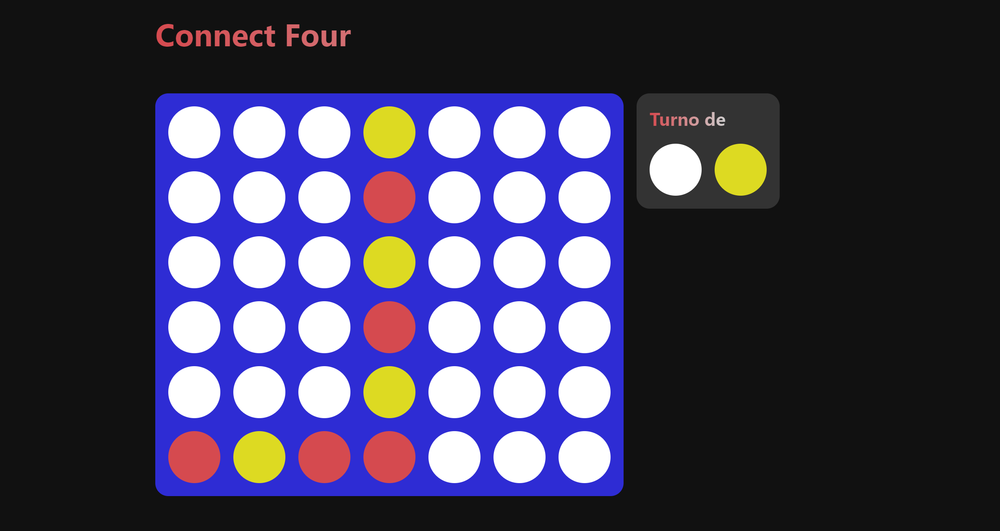

# Connect Four 🎮

Dos **jugadores**, elijan su **color** y conecten una fila o columna de sus **cuatro fichas**.

👉 Enlace: [https://connectfourdev.netlify.app/](https://connectfourdev.netlify.app/)  

📢 Feats:   
- Auto guardado de partidas con la Api de localStorage.  
- Validación de ganadores.
- Opción volver a empezar.  
- Juega en cualquier resolución.  

  
  
  
  
  
  
  

## Ganadores

¿Ganaste? ¡Recibes confetti!  
Puedes jugar cuantas veces quieras.  

# Instalación y uso 🎖️

**¡Código abierto al mundo!**    

- Puedes utilizar el producto realizando un `https://github.com/jevmydev/Connect-four` en tu terminal.  
- Luego emplear `npm run dev` en tu terminal para desplegar un entorno de desarrollo en la web.  

También dispones de: 

- `npm run build`: Empaquetar los módulos y construir un distribuible. 
- `npm run preview`: Despliege de un entorno de preview del distribuible.  
- `npm run lint`: Ejecutar eslint y arreglar los errores en el código.   
- `npm run format`: Ejecutar prettier y formatear el código.  
